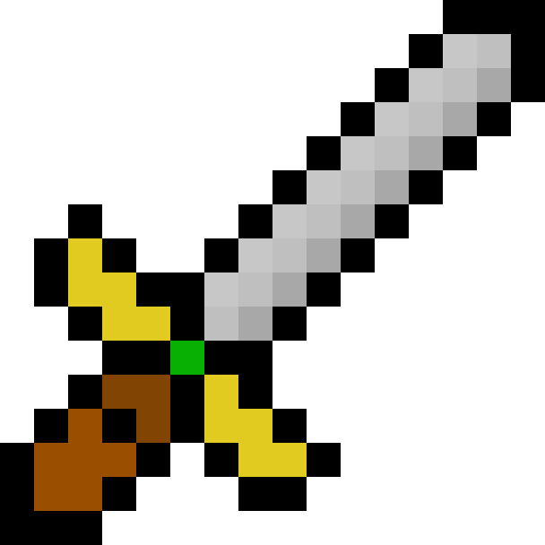

# awesome-reasoning

&nbsp;&nbsp;

  

Adding reasoning to your AI? Take these resources, they may help you on your way. 

 

## Datasets

| **AGI/causality/frml grammar** |                                            |                                                                               |
|--------------------------------|--------------------------------------------|-------------------------------------------------------------------------------|
| Deepmind Chomsky Hierarchy     | Problems crafted for FSM/PDA/TM            | [`[1]`](https://github.com/google-deepmind/neural_networks_chomsky_hierarchy) |
| automata                       | a neurallambda tool to gen from grammars   | [`[1]`](https://github.com/neurallambda/automata)                             |
| im a strange dataset           | Tough for LLMs because of self-references. | [`[1]`](https://github.com/TristanThrush/i-am-a-strange-dataset)              |
| DiagGSM8k                      | NL Reasoning Benchmark                     | [`[1]`](https://github.com/dvlab-research/MR-GSM8K)                           |
| CLadder                        | Causal reasoning                           | [`[1]`](https://huggingface.co/datasets/causalnlp/CLadder)                    |
| Cause-Effect Pairs             | 108 datasets of 2 var dynamics (not NL)    | [`[1]`](https://webdav.tuebingen.mpg.de/cause-effect/)                        |
| MNLI Entailment                | sentence parsing + entailment              | [`[1]`](https://huggingface.co/datasets/westphal-jan/mnli_entailment)         |

| **AGENT/TOOL**           |                                         |                                                                              |
|--------------------------|-----------------------------------------|------------------------------------------------------------------------------|
| THUDM AgentInstruct      | long form dialogs                       | [`[1]`](https://huggingface.co/datasets/THUDM/AgentInstruct)                 |
| WANG AgentInstruct       | gpt3 synthesized instructions           | [`[1]`](https://huggingface.co/datasets/WangResearchLab/AgentInstruct)       |
| KnowLM Tool              | prompt + tool call + answer             | [`[1]`](https://huggingface.co/datasets/zjunlp/KnowLM-Tool)                  |
| Glaive Tool Usage        | sys prompt says tools + prompt + answer | [`[1]`](https://huggingface.co/datasets/roborovski/glaive-tool-usage-dpo)    |
| opentoolformer retrieval | prompt + tool call                      | [`[1]`](https://huggingface.co/datasets/kenhktsui/open-toolformer-retrieval) |

| **CODE**         |                                   |                                                                   |
|------------------|-----------------------------------|-------------------------------------------------------------------|
| rosetta          | same program, many diff languages | [`[1]`](https://huggingface.co/datasets/cakiki/rosetta-code)      |
| EvoEval Tool Use | 100 prompt + code + tests         | [`[1]`](https://huggingface.co/datasets/evoeval/EvoEval_tool_use) |

| **MATH/LOGIC**  |                                                 |                                                                                 |
|-----------------|-------------------------------------------------|---------------------------------------------------------------------------------|
| gsm8k           | Grade School Math 8k                            | [`[1]`](https://huggingface.co/datasets/gsm8k)                                  |
| MetaMath        | one-shot math                                   | [`[1]`](https://github.com/meta-math/MetaMath)                                  |
| MetaMathFewShot | few-shot math                                   | [`[1]`](https://huggingface.co/datasets/abacusai/MetaMathFewshot)               |
| MathPile        | 9B tok from filtered internet                   | [`[1]`](https://huggingface.co/datasets/GAIR/MathPile)                          |
| LogiQA          | NL multi choice, requires abstraction           | [`[1]`](https://github.com/lgw863/LogiQA-dataset)                               |
| Logic-LM        | a model combining auto theorem provers and llms | [`[1]`](https://github.com/teacherpeterpan/Logic-LLM)                           |
| Coq Facts       | 270k cog theorem prover programs                | [`[1]`](https://huggingface.co/datasets/florath/coq-facts-props-proofs-gen0-v1) |

| **NATURAL LANGUAGE**           |                                            |                                                                                         |
|--------------------------------|--------------------------------------------|-----------------------------------------------------------------------------------------|
| UltraInteract_sft              | GPT generated iterated reasoning dialogs   | [`[1]`](https://huggingface.co/datasets/openbmb/UltraInteract_sft)                      |
| MUD videogames                 | (various could be training data)           |                                                                                         |
| Winogrande                     | ambiguous sentences, fill in 1 word        | [`[1]`](https://huggingface.co/datasets/winogrande)                                     |
| Winograd_wsc                   | ambiguous sentences, choose the right word | [`[1]`](https://huggingface.co/datasets/winograd_wsc)                                   |
| Contradiction                  | 2 phrases, do they contradict              | [`[1]`](https://www-nlp.stanford.edu/projects/contradiction/)                           |
| Recognizing Textual Entailment | 2 phrases, do they entail each other       | [`[1]`](https://github.com/hltfbk/EOP-1.2.1/wiki/Data-Sets)                             |
| Textual Entailment Pool        | more entailment                            | [`[1]`](https://www.aclweb.org/aclwiki/index.php?title=Textual_Entailment_Resource_Poo) |
| Answer Validation              | 2 phrases, does the answer solve question  | [`[1]`](http://nlp.uned.es/clef-qa/repository/ave.php)                                  |
| Monotonicity Entailment        | x is true, does y follow                   | [`[1]`](https://huggingface.co/datasets/tasksource/monotonicity-entailment)             |
| entailment                     | passage, question -> T/F                   | [`[1]`](https://huggingface.co/datasets/nc33/entailment)                                |
| Commonsense QA                 | muti choice QA                             | [`[1]`](https://allenai.org/data/commonsenseqa)                                         |
| GLUE                           | several datasets                           | [`[1]`](https://huggingface.co/datasets/nyu-mll/glue)                                   |
| custom multi-hop               | use wikipedia's graph of articles          |                                                                                         |

| **TOY PROBLEMS**                |                                       |                                                                        |
|---------------------------------|---------------------------------------|------------------------------------------------------------------------|
| SCAN | systematicity, "$x to the left" | [`[1]`](https://arxiv.org/pdf/1711.00350) |
| clevr | 2d img of 3d shapes + natural language QA | [`[1]`](https://www.tensorflow.org/datasets/catalog/clevr) |
| lambda calc + beta reductions | generator code, single+multistep | [`[1]`](https://github.com/jmflach/SymbolicLambda) |
| lichess-puzzles  | chess puzzles | [`[1]`](https://huggingface.co/datasets/EleutherAI/lichess-puzzles) |
| pointer net problems | convex hull, TSP, triangulation | [`[1]`](https://drive.google.com/drive/folders/0B2fg8yPGn2TCMzBtS0o4Q2RJaEU?resourcekey=0-46fqXNrTmcUA4MfT6GLcIg) |
| Big Bench Hard                  | 23 challenges (only 6k datapoints)    | [`[1]`](https://github.com/suzgunmirac/BIG-Bench-Hard)                 |
| logical entailment dataset      | logic strings by deepmind             | [`[1]`](https://huggingface.co/datasets/tasksource/logical-entailment) |
| logical entailment dataset code | (generate it yourself)                | [`[1]`](https://github.com/google-deepmind/logical-entailment-dataset) |
| FSM Game                        | generate strings according to grammar |                                                                        |
| Adaptive Grammar                | grammar rule might change             |                                                                        |
| String/Graph Rewriting          |                                       | [`string_rewriting.py`](./src/neurallambda_data/string_rewriting.py)   |
| LibraryOfLogic                  | generate NL from multiple games       | [`[1]`](https://github.com/nagolinc/LibraryOfLogic)                    |
| AB-XY Game                      |                                       |                                                                        |
| word ladder                     |                                       |                                                                        |
| parser                          |                                       |                                                                        |
| longest cmn subseq              |                                       |                                                                        |
| string reversal                 |                                       |                                                                        |
| wisconsin card sorting          |                                       |                                                                        |
| anagram                         |                                       |                                                                        |
| palindrome                      |                                       |                                                                        |
| permutation composition | | |

  

## Algorithms

| **TOKEN AUGMENTED REASONING** |                                                       |                                                                     |
|-------------------------------|-------------------------------------------------------|---------------------------------------------------------------------|
| Reasoning tokens              | Self-Reasoning Tokens, teaching models to think ahead | [`[1]`](https://reasoning-tokens.ghost.io/reasoning-tokens/)        |
| Quiet-STaR                    | LLMs Can Teach Themselves to Think Before Speaking    | [`[1]`](https://github.com/ezelikman/quiet-star?tab=readme-ov-file) |
